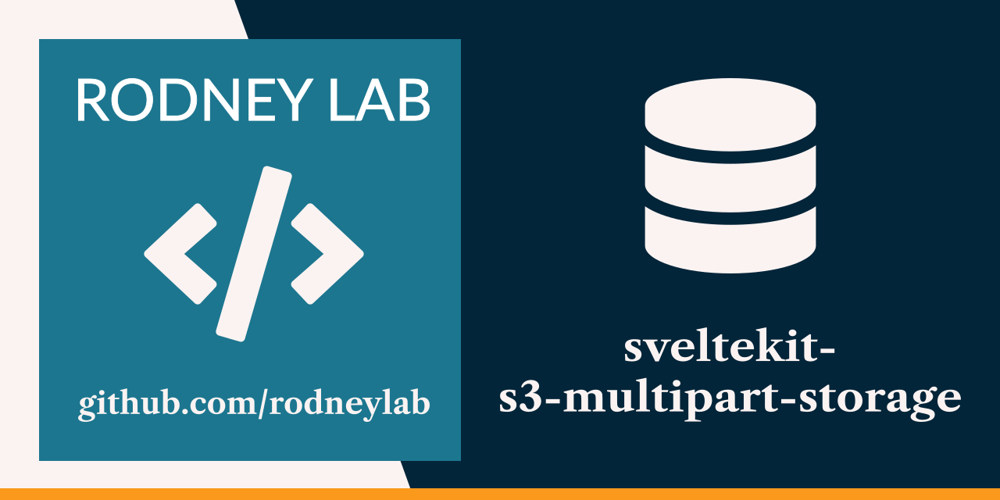

<p align="center">
  <a aria-label="Open Rodney Lab site" href="https://rodneylab.com" rel="nofollow noopener noreferrer">
    
  </a>
</p>
<h1 align="center">
  SvelteKit S3 Multipart Upload
</h1>

# sveltekit-s3-multipart-upload

[](https://open.vscode.dev/rodneylab/sveltekit-s3-multipart-upload)

Demo code for multipart upload using S3 compatible storage with SvelteKit. The code accompanies the <a aria-label="Open Rodney Lab blog post on using SvelteKit S3 multipart upload" href="https://rodneylab.com/sveltekit-s3-multipart-upload/">video on uploading larger files to S3 compatible storage using a SvelteKit app</a>. If you have any questions, please drop a comment at the bottom of that page.

## Building and previewing the site

If you're seeing this, you've probably already done this step. Congrats!

```bash
git clone https://github.com/rodneylab/sveltekit-s3-multipart-upload.git
cd sveltekit-s3-multipart-upload
pnpm install # or npm install
pnpm run dev
```

## Building

```bash
pnpm run build
```

> You can preview the built app with `pnpm run preview`, regardless of whether you installed an adapter. This should _not_ be used to serve your app in production.
